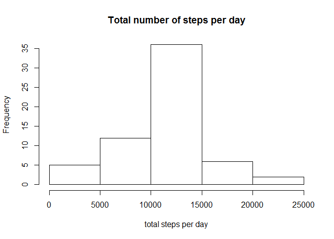

Loading and preprocessing the data
----------------------------------

### loading

``` r
activity <- read.csv("activity.csv", na.strings = NA, stringsAsFactors = F, colClasses = c("numeric", "character", "numeric"))
```

### preprocessing

``` r
activity$date <- as.Date(activity$date, format = "%Y-%m-%d")
```

What is mean total number of steps taken per day?
-------------------------------------------------

### total number per day

``` r
stepsperday <- sapply(split(activity$steps, activity$date), sum, na.rm = T)
```

### histogram and barplot

``` r
hist(stepsperday, main = "Total number of steps per day", 
     xlab = "total steps per day")
```


``` r
barplot(stepsperday, main = "Total number of steps per day", 
        ylab = "total steps per day")
```


### report mean and median

``` r
sprintf("The mean of total number of steps per day is %.f.", mean(stepsperday))
```

    ## [1] "The mean of total number of steps per day is 9354."

``` r
sprintf("The median of total number of steps per day is %.f.",
        median(stepsperday))
```

    ## [1] "The median of total number of steps per day is 10395."

What is the average daily activity pattern?
-------------------------------------------

### time series plot

``` r
acrossallday <- do.call(cbind, split(activity$steps, activity$date))
acrossallday_interval <- apply(acrossallday, 1, mean, na.rm = TRUE)
interval <- unique(as.character(activity$interval))
names(acrossallday_interval) <- interval
plot(interval, acrossallday_interval, type = 'l',
     ylab = "average steps per interval",
     xlab = "interval")
```


### Which 5-minute interval consists the max steps?

``` r
max_interval <- names(acrossallday_interval[which.max(acrossallday_interval)])
sprintf(paste(max_interval, "interval consists the max steps."))
```

    ## [1] "835 interval consists the max steps."

Imputing missing values
-----------------------

### total number of missing values

``` r
sum_na <- sum(is.na(activity$steps))
sprintf("The total number of missing values is %.f", sum_na)
```

    ## [1] "The total number of missing values is 2304"

### Missing values filled in

``` r
# Using mean for that interval to fill in
patch <- function(a) {
        mask <- is.na(a)
        a[mask] <- acrossallday_interval[mask]
        a
}
activity_1 <- transform(activity, interval = as.character(activity$interval))
stepsbydaylist <- split(activity_1$steps, activity_1$date)
patchsteps <- lapply(stepsbydaylist, patch)
activity_1$steps <- unlist(patchsteps)
```

### total number per day after patching

``` r
patchstepsperday <- sapply(split(activity_1$steps, activity$date), sum)
```

### histogram after patching

``` r
hist(patchstepsperday, main = "Total number of steps per day", 
     xlab = "total steps per day")
```



### report mean and median

``` r
sprintf("The mean of total number of steps per day is %.f.", 
        mean(patchstepsperday))
```

    ## [1] "The mean of total number of steps per day is 10766."

``` r
sprintf("The median of total number of steps per day is %.f.",
        median(patchstepsperday))
```

    ## [1] "The median of total number of steps per day is 10766."

Are there differences in activity patterns between weekdays and weekends?
-------------------------------------------------------------------------

### create new variable weekday

``` r
weekends <- c("Saturday", "Sunday")
library(dplyr)
```

    ## 
    ## Attaching package: 'dplyr'

    ## The following objects are masked from 'package:stats':
    ## 
    ##     filter, lag

    ## The following objects are masked from 'package:base':
    ## 
    ##     intersect, setdiff, setequal, union

``` r
activity <- mutate(activity, weekday = ifelse(weekdays(activity$date) %in% weekends, "weekend", "weekday"))
activity <- mutate(activity, weekday = as.factor(weekday))
activity <- mutate(activity, interval = as.character(interval))
```

### make plot of weekdays and weekends

``` r
activity_weekday <- subset(activity, weekday == "weekday")
activity_weekend <- subset(activity, weekday == "weekend")
interval_num <- as.numeric(interval)
interval_wd <- data.frame(split(activity_weekday$steps, activity_weekday$date))
interval_we <- data.frame(split(activity_weekend$steps, activity_weekend$date))
interval_wd_day <- rowMeans(interval_wd, na.rm = T)
interval_we_day <- rowMeans(interval_we, na.rm = T)
interval_wd_day_df <- data.frame(interval_wd_day, weekday = "weekday", interval = interval_num)
interval_we_day_df <- data.frame(interval_we_day, weekday = "weekend", interval = interval_num)
names(interval_wd_day_df)[1] <- "steps"
names(interval_we_day_df)[1] <- "steps"
interval_wd_we_df <- rbind(interval_wd_day_df, interval_we_day_df)
library(lattice)
xyplot(steps ~ interval | weekday, data = interval_wd_we_df, layout = c(1, 2), type = 'l')
```


